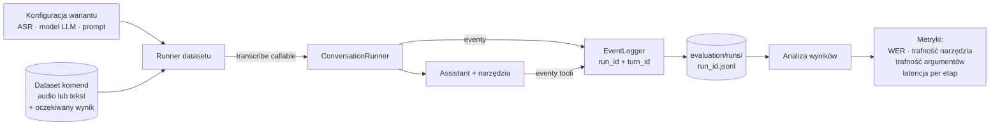

```mermaid
flowchart LR
    Cfg["Konfiguracja wariantu<br/>ASR · model LLM · prompt"]
    DS[("Dataset komend<br/>audio lub tekst<br/>+ oczekiwany wynik")]
    Run["Runner datasetu"]
    CR["ConversationRunner"]
    AS["Assistant + narzędzia"]
    LG["EventLogger<br/>run_id + turn_id"]
    J[("evaluation/runs/<br/>run_id.jsonl")]
    An["Analiza wyników"]
    Mt["Metryki:<br/>WER · trafność narzędzia<br/>trafność argumentów<br/>latencja per etap"]

    Cfg --> Run
    DS --> Run
    Run -->|transcribe callable| CR
    CR --> AS
    CR -->|eventy| LG
    AS -->|eventy tooli| LG
    LG --> J
    J --> An
    An --> Mt
```