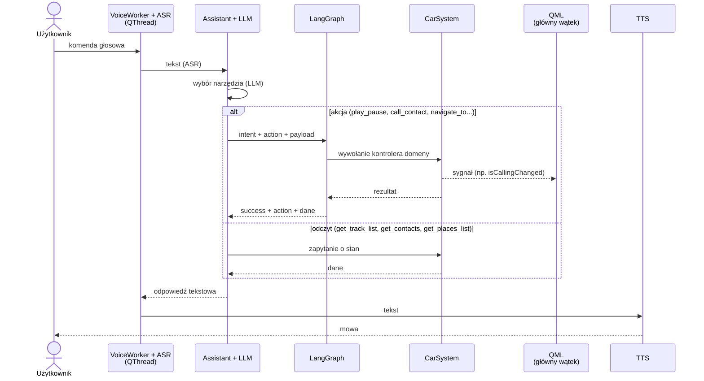

```mermaid
sequenceDiagram
    actor U as Użytkownik
    participant W as VoiceWorker + ASR<br/>(QThread)
    participant A as Assistant + LLM
    participant G as LangGraph
    participant C as CarSystem
    participant Q as QML<br/>(główny wątek)
    participant T as TTS

    U->>W: komenda głosowa
    W->>A: tekst (ASR)
    A->>A: wybór narzędzia (LLM)

    alt akcja (play_pause, call_contact, navigate_to...)
        A->>G: intent + action + payload
        G->>C: wywołanie kontrolera domeny
        C-->>Q: sygnał (np. isCallingChanged)
        C-->>G: rezultat
        G-->>A: success + action + dane
    else odczyt (get_track_list, get_contacts, get_places_list)
        A->>C: zapytanie o stan
        C-->>A: dane
    end

    A-->>W: odpowiedź tekstowa
    W->>T: tekst
    T-->>U: mowa
```
