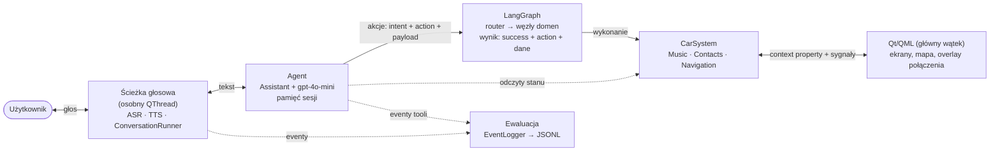

```mermaid
flowchart LR
    User([Użytkownik])
    Voice["Ścieżka głosowa<br/>(osobny QThread)<br/>ASR · TTS · ConversationRunner"]
    Agent["Agent<br/>Assistant + gpt-4o-mini<br/>pamięć sesji"]
    Graph["LangGraph<br/>router → węzły domen<br/>wynik: success + action + dane"]
    Car["CarSystem<br/>Music · Contacts · Navigation"]
    UI["Qt/QML (główny wątek)<br/>ekrany, mapa, overlay połączenia"]
    Eval["Ewaluacja<br/>EventLogger → JSONL"]

    User <-->|głos| Voice
    Voice <-->|tekst| Agent
    Agent -->|akcje: intent + action + payload| Graph
    Graph -->|wykonanie| Car
    Agent -.->|odczyty stanu| Car
    Car <-->|context property + sygnały| UI
    Voice -.->|eventy| Eval
    Agent -.->|eventy tooli| Eval
```